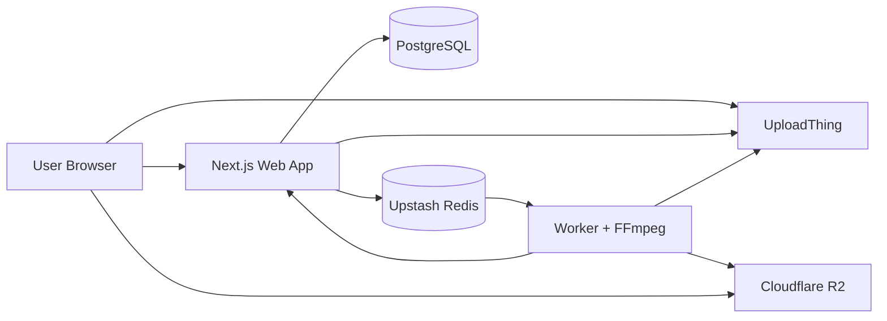

# Vidora

Vidora is a full-stack video hosting platform that lets authenticated users upload videos, process them asynchronously, and stream them back through adaptive HLS playback.

This project is strong portfolio material because it is not just a CRUD app. It combines a modern web product, a background processing pipeline, object storage, queue-based job orchestration, and public playback links in one system.

## Why This Project Stands Out

- Built as a monorepo with a separate Next.js app and transcoding worker
- Handles asynchronous media processing instead of blocking the request cycle
- Produces multi-bitrate HLS output for adaptive streaming
- Uses user-scoped data access for dashboards, jobs, and video management
- Supports public watch pages, share links, view counts, and thumbnail workflows
- Includes retry-aware background processing and status polling for long-running jobs

## Feature Set

- Google sign-in with NextAuth
- Drag-and-drop video uploads
- Title and description metadata
- Optional client-side thumbnail capture from a random video frame
- Background transcoding with FFmpeg
- HLS renditions at `240p`, `480p`, `720p`, and `1080p`
- Master playlist generation for adaptive playback
- Upload of processed assets to Cloudflare R2
- Personal video library for each signed-in user
- Transcoding jobs page with live progress polling
- Public watch pages at `/w/[id]`
- Shareable watch links and direct stream URLs
- Rename and delete actions from the dashboard
- View tracking and basic engagement counters

## Architecture

### `web/`
Next.js 16 app using the App Router. It handles authentication, upload initiation, dashboard pages, public watch pages, and internal API routes.

### `worker/`
Node.js background service that consumes queued jobs, downloads source files, runs FFmpeg, creates HLS playlists and segments, uploads outputs to R2, and reports progress back to the web app.

### Supporting Services

- PostgreSQL for users, sessions, and video metadata
- Prisma for schema and database access
- Upstash Redis for the job queue and transient job status
- UploadThing for intake uploads and thumbnail uploads
- Cloudflare R2 for processed playback assets

## Architecture Diagram



## Processing Flow

1. A user signs in and uploads a video from the web app.
2. The web app stores metadata in Postgres and pushes a job into Redis.
3. The worker pulls the job, downloads the source asset, and transcodes it with FFmpeg.
4. The worker generates HLS playlists and segment files for multiple resolutions.
5. The processed files are uploaded to Cloudflare R2.
6. The worker reports progress and final status back to the web app.
7. The user can monitor the job on `/tasks` and watch the final video on `/w/[id]`.

## Tech Stack

- Next.js 16
- React 19
- TypeScript
- Tailwind CSS
- NextAuth
- Prisma + PostgreSQL
- Upstash Redis
- UploadThing
- Cloudflare R2
- FFmpeg
- TanStack Query
- Vidstack / HLS playback

## Local Development

### Prerequisites

- Node.js 20+
- Bun
- FFmpeg
- PostgreSQL
- Upstash Redis database
- Cloudflare R2 bucket
- UploadThing app

### Install Dependencies

```bash
npm install
npm --prefix web install
npm --prefix worker install
```

### Configure the Database

```bash
cd web
npx prisma generate
npx prisma db push
```

### Environment Variables

Create `web/.env`:

```env
DATABASE_URL="postgresql://..."
UPSTASH_REDIS_REST_URL="..."
UPSTASH_REDIS_REST_TOKEN="..."
R2_PUBLIC_URL="..."
NEXT_PUBLIC_R2_PUBLIC_URL="..."
UPLOADTHING_TOKEN="..."
AUTH_GOOGLE_ID="..."
AUTH_GOOGLE_SECRET="..."
AUTH_SECRET="..."
WORKER_SHARED_SECRET=""
```

Create `worker/.env`:

```env
CLOUDFLARE_ACCOUNT_ID="..."
R2_ACCESS_KEY_ID="..."
R2_SECRET_ACCESS_KEY="..."
UPSTASH_REDIS_REST_URL="..."
UPSTASH_REDIS_REST_TOKEN="..."
BACKEND_URL="http://localhost:3000"
WORKER_SHARED_SECRET=""
```

If `WORKER_SHARED_SECRET` is used, the value must match in both services.

### Start the App

From the repo root:

```bash
npm run dev:web
npm run dev:worker
```

Or run each service directly:

```bash
cd web && npm run dev
cd worker && npm run dev
```

## Useful Scripts

```bash
# root
npm run dev:web
npm run dev:worker
npm run build:web
npm run build:worker
npm run lint:web

# worker
npm --prefix worker run typecheck
```

## Deployment

Recommended production layout:

- deploy [`web/`](/home/thetanav/c/p/vidora/web) to Vercel
- deploy [`worker/`](/home/thetanav/c/p/vidora/worker) to Railway or another Docker host
- use managed Postgres, Upstash Redis, UploadThing, and Cloudflare R2

The full deployment guide lives at [docs/deployment.md](/home/thetanav/c/p/vidora/docs/deployment.md).

## API Surface

- `POST /api/upload` creates a video record and enqueues a processing job
- `GET /api/videos` returns videos for the signed-in user
- `PATCH /api/videos/:id` updates signed-in user video metadata
- `DELETE /api/videos/:id` deletes a signed-in user video
- `GET /api/status/:id` returns current processing progress
- `GET /api/sw/:id` returns the playback stream URL
- `POST /api/videos/:id/view` increments the public view count
- `GET /api/videos/:id/share` returns watch and stream links

## Resume-Ready Talking Points

If you put this on a resume, describe it in terms of systems and outcomes, not just framework names.

- Built a full-stack video platform with asynchronous media processing, adaptive HLS streaming, and per-user content management
- Designed a queue-driven transcoding pipeline using Redis, FFmpeg, and object storage to offload heavy video processing from the request path
- Implemented multi-service architecture across Next.js, Prisma/Postgres, UploadThing, and Cloudflare R2 for upload intake, metadata persistence, and media delivery

## Best Additions To Make It Even Stronger

These are the highest-value upgrades if the goal is to make the project more impressive to recruiters and hiring managers.

### 1. Production Observability

Add structured logs, error tracking, and basic metrics:

- request IDs across web and worker
- job duration and failure-rate metrics
- Sentry or similar error reporting
- dashboard for queue depth and processing latency

Why it helps: it shows you can operate a distributed system, not just build one locally.

### 2. Automated Testing + CI

Add a real quality bar:

- unit tests for upload validation and URL helpers
- integration tests for API routes
- worker tests for retry logic and playlist generation
- GitHub Actions for lint, typecheck, and test runs

Why it helps: this is one of the fastest ways to make the project look professional.

### 3. Resumable or Multipart Uploads

Large-video handling is a strong upgrade:

- multipart uploads
- resumable uploads
- file-size enforcement and upload validation
- checksum or integrity verification

Why it helps: it moves the app closer to real production media tooling.

### 4. Privacy and Access Control

Right now the app is strongest as a personal video platform. Expand it with:

- public/private/unlisted visibility
- signed playback URLs
- owner-only stream access for private videos
- expiring share links

Why it helps: it demonstrates practical product design and security thinking.

### 5. Better Media Intelligence

Add features that make the content layer smarter:

- subtitle upload and WebVTT support
- automatic caption generation
- searchable transcripts
- thumbnail timeline scrubbing or multiple generated thumbnails

Why it helps: it turns the project from a demo into a platform.

### 6. Deployment and Infrastructure Story

Make the deployment reproducible:

- Docker Compose for local dependencies
- IaC for storage, database, and worker config
- deployment guide for Vercel + Railway/Fly.io
- architecture diagram in the README

Why it helps: hiring teams care about whether you can ship and run what you build.

## Recommended Next Milestone

If you want the fastest path to a more resume-worthy version, build this combination next:

1. add automated tests and GitHub Actions
2. add private/unlisted videos with signed URLs
3. add structured logs and failure monitoring
4. add a simple architecture diagram and screenshots to this README

That combination improves technical depth, product maturity, and presentation at the same time.

## Current Gaps

The project already has a solid foundation, but a reviewer will still look for:

- automated tests
- CI/CD
- observability
- deployment documentation
- stronger security controls around media access

Addressing those gaps will materially improve how this project reads on a resume.
