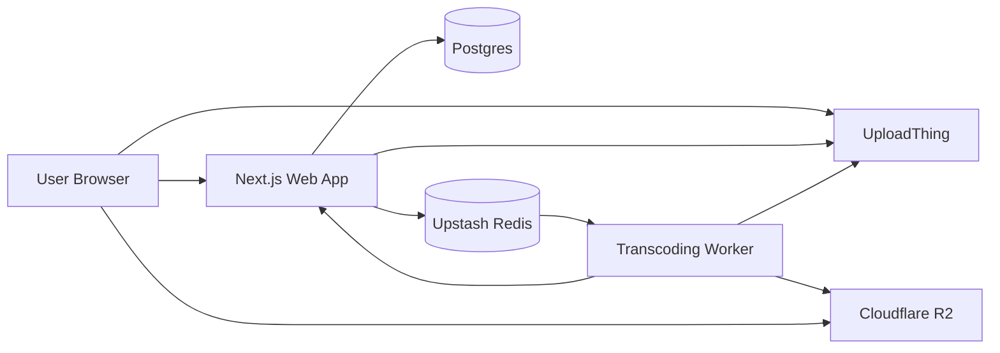

# Deployment Guide

This document describes a practical production deployment for Vidora using:

- Vercel for the `web/` app
- Railway or any Docker host for the `worker/` service
- Postgres for the database
- Upstash Redis for queueing and transient job status
- Cloudflare R2 for processed HLS assets
- UploadThing for upload intake

## Deployment Topology



## Services

### 1. Web App

Deploy the [`web/`](/home/thetanav/c/p/vidora/web) directory as its own project.

Recommended host: Vercel

Why this fits:

- the app is already a Next.js App Router project
- authentication and Prisma usage require a Node runtime
- Vercel handles the frontend and server routes cleanly

Suggested Vercel settings:

- Root Directory: `web`
- Install Command: `npm install`
- Build Command: `npm run build:node`
- Output Directory: leave default for Next.js

### 2. Worker

Deploy the [`worker/`](/home/thetanav/c/p/vidora/worker) directory as a separate long-running service.

Recommended host: Railway

Why this fits:

- the worker needs FFmpeg installed
- it runs continuously and pulls jobs from Redis
- a Docker-based host is the simplest production shape

The repository already includes [`worker/Dockerfile`](/home/thetanav/c/p/vidora/worker/Dockerfile), which installs FFmpeg and runs the compiled worker.

Suggested Railway settings:

- Root Directory: `worker`
- Builder: Dockerfile
- Start Command: use Docker default
- Restart Policy: always

### 3. Managed Dependencies

Use managed services for:

- Postgres
- Upstash Redis
- Cloudflare R2
- UploadThing

This keeps the project easy to deploy and closer to a production-grade architecture.

## Environment Variables

### Web

Set these for the `web` deployment:

```env
DATABASE_URL="postgresql://..."
UPSTASH_REDIS_REST_URL="..."
UPSTASH_REDIS_REST_TOKEN="..."
R2_PUBLIC_URL="https://<public-r2-domain>"
NEXT_PUBLIC_R2_PUBLIC_URL="https://<public-r2-domain>"
UPLOADTHING_TOKEN="..."
AUTH_GOOGLE_ID="..."
AUTH_GOOGLE_SECRET="..."
AUTH_SECRET="..."
WORKER_SHARED_SECRET="..."
```

Notes:

- `R2_PUBLIC_URL` and `NEXT_PUBLIC_R2_PUBLIC_URL` should point at the public base URL used to serve HLS assets and thumbnails.
- `AUTH_SECRET` should be a long random secret in production.
- `WORKER_SHARED_SECRET` should be set in both services to protect worker callbacks.

### Worker

Set these for the `worker` deployment:

```env
CLOUDFLARE_ACCOUNT_ID="..."
R2_ACCESS_KEY_ID="..."
R2_SECRET_ACCESS_KEY="..."
UPSTASH_REDIS_REST_URL="..."
UPSTASH_REDIS_REST_TOKEN="..."
BACKEND_URL="https://<your-web-domain>"
WORKER_SHARED_SECRET="..."
```

Notes:

- `BACKEND_URL` must point to the deployed web app, not localhost.
- `WORKER_SHARED_SECRET` must exactly match the value used by the web app.

## Production Rollout

### Step 1. Provision backing services

Create:

- a Postgres database
- an Upstash Redis database
- a Cloudflare R2 bucket
- an UploadThing app
- Google OAuth credentials for authentication

### Step 2. Configure the database

Run Prisma against production before sending traffic to the app.

From [`web/`](/home/thetanav/c/p/vidora/web):

```bash
npx prisma generate
npx prisma db push
```

If you adopt migration-based releases later, replace `db push` with checked-in Prisma migrations.

### Step 3. Deploy the web app

Deploy the [`web/`](/home/thetanav/c/p/vidora/web) directory with the environment variables listed above.

After deploy, verify:

- `/login` loads
- Google sign-in works
- authenticated pages load without Prisma or auth errors

### Step 4. Deploy the worker

Deploy the [`worker/`](/home/thetanav/c/p/vidora/worker) directory from the existing Dockerfile.

After deploy, verify:

- the service stays healthy after restart
- FFmpeg is available in the runtime image
- the worker can read from Redis
- callback requests to the web app succeed

### Step 5. Validate the full flow

Run a real upload through production:

1. sign in
2. upload a sample video
3. confirm a row is created in Postgres
4. confirm a Redis job is queued and consumed
5. confirm HLS assets appear in R2
6. confirm `/tasks` shows progress
7. confirm `/w/[id]` plays successfully

## Release Checklist

Before calling the deployment production-ready, verify:

- `WORKER_SHARED_SECRET` is set in both services
- `BACKEND_URL` points to the deployed web app
- `R2_PUBLIC_URL` resolves publicly
- OAuth callback URLs are configured correctly
- Prisma schema has been applied to the production database
- the worker can restart without losing its configuration
- at least one upload and playback test passed in production

## Operational Notes

### Logging

At minimum, collect logs from both services:

- web request failures
- upload creation failures
- worker job lifecycle events
- FFmpeg failures
- R2 upload failures

### Scaling

As traffic grows:

- scale the web app independently from the worker
- keep the worker stateless so multiple replicas can consume the queue
- move from polling toward push updates or websockets if job volume increases

### Security

The current production baseline should include:

- a strong `AUTH_SECRET`
- a non-empty `WORKER_SHARED_SECRET`
- least-privilege R2 credentials
- restricted OAuth callback URLs

Future improvement:

- signed stream URLs for private or unlisted videos

## Common Failure Points

### Worker cannot report status

Check:

- `BACKEND_URL`
- `WORKER_SHARED_SECRET`
- network access from the worker to the web app

### Playback URL returns 404

Check:

- R2 bucket upload success
- public bucket or CDN configuration
- `R2_PUBLIC_URL` / `NEXT_PUBLIC_R2_PUBLIC_URL`

### Upload works but jobs never finish

Check:

- Redis credentials
- worker health
- FFmpeg availability in the worker runtime
- R2 credentials and bucket permissions
